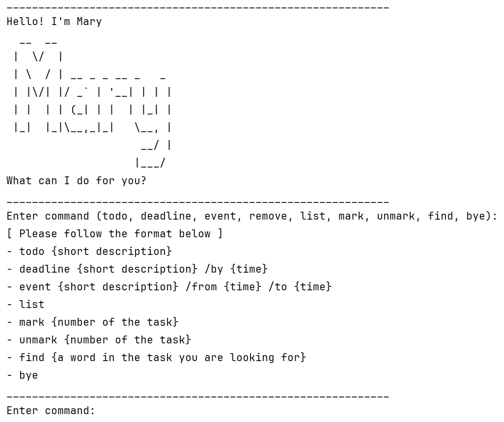

# Mary User Guide


This is a Java chatbot which has simple features to manage your schedule. 

## Adding todos
adds a todo item to the list 
Format: `todo {short description}`
Example: `todo eat lunch with Sam`
Expected Output: 
```
____________________________________________________________ 
Got it. I've added this task:
	[T][ ] eat lunch with Sam
Now you have 1 task(s) in the list.
____________________________________________________________ 
```
## Adding deadlines
adds a deadline item to the list
Format: `deadline {short description} /by {time}`
Example: `deadline finish hw /by 02-03-2025 3pm`
Expected Output:
```
____________________________________________________________ 
Got it. I've added this task:
	[D][ ] finish hw (by: 02-03-2025 3pm)
Now you have 2 task(s) in the list.
____________________________________________________________ 
```
## Adding events
adds a event item to the list
Format: `event {short description} /from {time} /to {time}`
Example: `event field trip to Vietnam /from 02-05-2025 /to 02-10-2025`
Expected Output:
```
____________________________________________________________ 
Got it. I've added this task:
	[E][ ] field trip to Vietnam (from: 02-05-2025 to: 02-10-2025)
Now you have 3 task(s) in the list.
____________________________________________________________ 
```

## Displaying the list 
displays all the items in the list 
Format: `list`
Example: `list`
Expected Output:
```
____________________________________________________________ 
Here are the tasks in your list:
	1. [T][ ] eat lunch with Sam
	2. [D][ ] finish hw (by: 02-03-2025 3pm)
	3. [E][ ] field trip to Vietnam (from: 02-05-2025 to: 02-10-2025)
____________________________________________________________ 

```

## Marking the given task as done 
marks the given item as done
Format: `mark {number of the task}`
Example: `mark 1`
Expected Output:
```
____________________________________________________________ 
Nice! I've marked this task as done: 
	[T][X] eat lunch with Sam
____________________________________________________________ 
```

## Marking the given task as undone
marks the given item as undone
Format: `unmark {number of the task}`
Example: `unmark 1`
Expected Output:
```
____________________________________________________________ 
Nice! I've marked this task as not done yet: 
	[T][ ] eat lunch with Sam
____________________________________________________________ 
```
## Finding the task with the given keyword
finds the task items with the given keyword from the list and shows them 
Format: `find {a word in the task you are looking for}`
Example: `find trip`
Expected Output:
```
____________________________________________________________ 
Here are the matching tasks in your list.
	1. [E][ ] field trip to Vietnam (from: 02-05-2025 to: 02-10-2025)
____________________________________________________________ 

```

## Terminating the program 
ends the program 
Format: `bye`
Example: `bye`
Expected Output:
```
Saving 3 tasks to ./data/mary.txt
```
